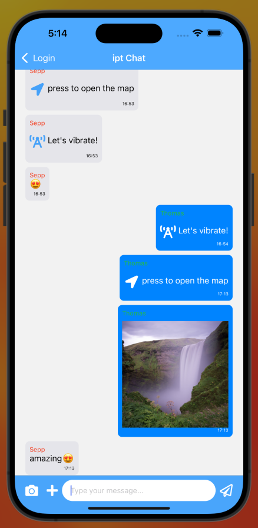
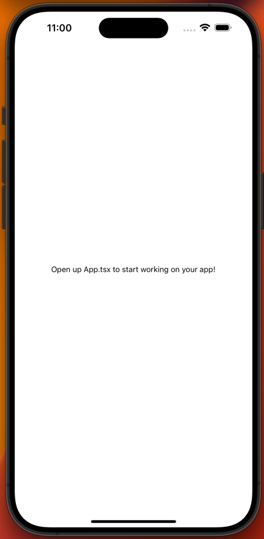
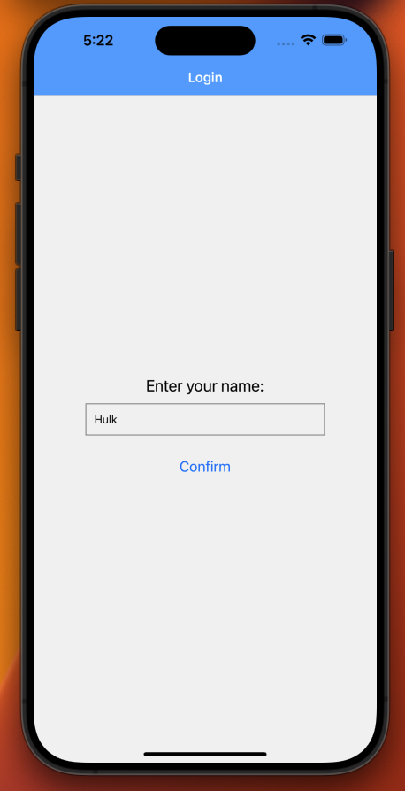
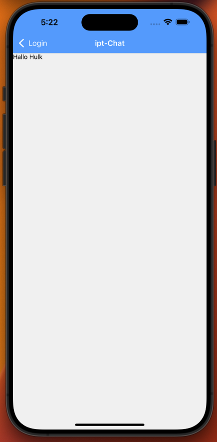
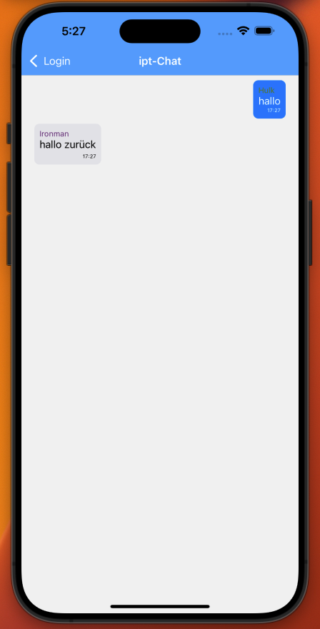

# react-native-chat

Dies ist ein Tutorial zur Erstellung einer mobile Chat App mit React Native. 
Der gesamte Code zu diesem Tutorial befindet sich im **main-branch**. dieses Repository. 
Für die einzelnen Kapitel wurde jeweils ein Branch mit einem Zwischenstand erstellt. 
Diese werden in den einzelnen Abschnitten erwähnt.



## Table of Contents

- [Voraussetzungen](#voraussetzungen)
- [1. Demo App erstellen](#1-demo-app-erstellen)
  - [1.1. Projekt erstellen und Demo App starten](#11-projekt-erstellen-und-demo-app-starten-)
  - [1.2. Mache dich mit React Native vertraut](#12-mache-dich-mit-react-native-vertraut-)
  - [1.3. App deployen (Development builds)](#13-app-deployen-development-builds-)
- [2. Basic Chat App entwickeln](#2-basic-chat-app-entwickeln)
  - [2.1. Login Screen](#21-login-screen)
  - [2.2. Chat Screen](#22-chat-screen)
- [3. Weitere Features einbauen](#weitere-features-einbauen)
  
## 1. Demo App erstellen

In einem ersten Schritt erstellen wir eine Demo App. Diese kann wahlweise auf dem eigenen mobilen Gerät, im Android Emulator oder im iOS Simulator geöffnet werden. 

**Emulatoren installieren**
Auf Windows kann nur der Android Emulator installiert werden.
Auf einem Mac können beide installiert werden. Hier sind die Installationsanleitungen dafür:

- Android Emulator installieren: https://docs.expo.dev/workflow/android-studio-emulator/
- iOS Simulator installieren: https://docs.expo.dev/workflow/ios-simulator/

### Expo

Wir verwenden während der gesamten Entwicklung das Tool Expo:

[Expo](https://expo.dev/) ist eine Open-Source-Plattform für die Entwicklung von mobilen Anwendungen für iOS und Android mit JavaScript und React Native.
Obwohl Expo nicht zum gleichen Projekt gehört wie React Native, wird in den React Native Dokumentationen offiziell empfohlen, Expo bei der Entwicklung von React Native zu verwenden: https://reactnative.dev/docs/environment-setup.

**Hauptmerkmale**

- Entwicklung ohne nativen Code
- Vorgefertigte UI-Komponenten
- Expo-CLI für Entwicklungs- und Bereitstellungsaufgaben
- Expo Go für das Testen auf physischen Geräten
- Verschiedene Expo-Dienste und APIs
- Over-the-Air-(OTA)-Updates für schnelle Aktualisierungen
- Aktive Entwickler-Community und Erweiterungen

Bitte beachten Sie, dass Expo nicht alle nativen Funktionen und APIs von iOS und Android unterstützt und in bestimmten Fällen native Entwicklung erforderlich sein kann.

### 1.1. Projekt erstellen und Demo App starten 

#### Workspace erstellen
In diesem Tutorial baust du die App selber vom Grund auf. Dieses Repository soll nicht direkt gecloned werden, sondern führt lediglich durchs Tutorial und enthält den gesamten Code um deine eigen Lösung vergleichen zu können.

Um deine eigene App entwickeln zu können, erstelle ein eigenes Repository.

#### Expo Projekt erstellen
Wir erstellen mit Expo ein neues Projekt. Führe dazu im Terminal deiner IDE folgenden Befehl aus:

**TypeScript:** Mit dem Parameter --template kann man das Projekt als TypeScript Projekt erstellen. Ohne diesen Parameter wird es in Javascript erstellt. Da alle Beispiele in TypeScript erstellt wurden, wird dies auch empfohlen zu verwenden.

```bash
npx create-expo-app react-native-chat --template
##Wähle "Blank (TypeScript)" aus.
cd react-native-chat
```
Du solltest nun eine Meldung sehen, dass das Projekt erfolgreich erstellt wurde. 
Du kannst deine App nun starten und bereits im Simulator oder auf deinem eigenen mobilen Gerät starten. 
Um die App zu starten führe folgenden Befehl aus:

```bash
npm start
```
Du siehst nun in der Konsole die verschiedenen Optionen um die App auf einem Gerät zu verwenden.

**Starten mit eigenem Device**<br>
Lade und installiere zuerst über den AppStore (Android oder iOS) die App `Expo GO`. 
In der Konsole auf deinem Computer siehst du einen QR-Code.
Wenn du ein Android-Gerät hast, scanne diesen QR-Code in deiner Expo GO App.
Wenn du ein iPhone hast, scanne diesen QR-Code mit deiner normalen Kamera-App.
Das Scannen des QR-Codes öffnet nun deine erstellte App in der Expo GO App.<br>
Mehr Infos findest du hier: https://expo.dev/client.

**Starten mit Simulator**<br>
In der Konsole ist beschrieben, wie du die App in verschiedenen Simulatoren verwenden kannst.
Beachte, dass du für die Simulatoren vorgängig die in [Voraussetzungen](#voraussetzungen-voraussetzungen) aufgeführten Schritte machen musst..

Du solltest nun die deine Demo App sehen können:



### 1.2. Mache dich mit React Native vertraut 
1. [ ] Die Demo App ist ein guter Start sich ein wenig mit den Eigenheiten von React Native vertraut zu machen und etwas herumzuspielen.
2. [ ] Bist du noch neu in React, dann empfiehlt es sich hier kurz die **Basics** anzuschauen: https://reactnative.dev/docs/intro-react.
3. [ ] Du solltest dich mit dem **State-Handling** vertraut machen, da wir dies für unsere Chat-App häufig verwenden: https://reactnative.dev/docs/intro-react#state.
4. [ ] Auf dieser Seite findest du alle **Komponenten** die React Native im Standard anbietet: https://reactnative.dev/docs/components-and-apis.
5. [ ] Es empfiehlt sich auch kurz das **Styling** anzuschauen, da es ohne klassische CSS-Files auskommt: https://reactnative.dev/docs/stylesheet. Für das Layout wird Flexbox verwendet. Wenn du das in CSS noch nicht verwendet hast, dann erhältst du hier einen Einblick: https://reactnative.dev/docs/flexbox

Gehe in dein [App.tsx](./App.tsx) rein und spiele etwas herum. Du wirst sehen, dass Änderungen automatisch auf deinem Handy oder im Simulator nachgeladen werden.

### 1.3. App deployen (Development builds) 
Mit Expo kann man sehr schnell und einfach seine App auf verschiedenen Geräten testen. Am Schluss möchte man jedoch die App ausserhalb der Expo GO App auf seinem Handy testen können.
Dieser Prozess wird mit der Verwendung von Expo ebenfalls vereinfacht. Für iOS wird leider eine Apple Developer membership benötigt.
Daher überspringen wir diesen Teil und arbeiten weiter mit der Expo Go App. Falls es dich trotzdem interessiert, findest du hier alle Informationen: https://docs.expo.dev/develop/development-builds/introduction/

## 2. Basic Chat App entwickeln
In diesem Schritt erstellen wir die ipt-Chat App, mit welcher du, angebunden an die Google Firebase Datenbank, mit den anderen ipt'lern chatten kannst.
Diese Version besteht aus zwei Screens:
**Login:** Hier kann man seinen Namen eingeben, dieser wird dann im Chat als Absender verwendet und ist für die anderen User sichtbar
**Chat:** Der Chat Screen besteht aus einer Liste von Nachrichten und einem Inputfeld und einem Sendbutton um neue Nachrichten verschicken zu können.

Wir gehen nun die einzelnen Entwicklungsschritte durch:

## 2.1. Login Screen
Der Code für diese Aufgabe befindet sich im Branch **chat-login**.
Erstelle im Hauptverzeichnis (neben App.tsx) eine neues File Login.tsx und füge irgendwelchen Inhalt hinzu. Z.B. so:

<details>

<summary>Code ansehen</summary>

~~~typescript
import {Text, View} from "react-native";

export default function Login() {

  return (
          <View>
                  <Text>Login</Text>
          </View>
  );
};
~~~

</details>

Nun müssen wir sicherstellen, dass beim Start der App auf diesen Screen navigiert wird. Dazu müssen wir in dem bestehnden File [App.tsx](./App.tsx) die Navigation einfügen.
Für die Navigation verwenden wir folgende Library: https://reactnavigation.org/docs/getting-started/. Führe dazu folgende Befehle aus:
```bash
npm install @react-navigation/native
npx expo install react-native-screens react-native-safe-area-context
npm install @react-navigation/native-stack
```
Auf reactnavigation.org findest du Beispiele, wie eine Navigation erstellt werden kann. 
Am Schluss müsste es ungefähr aussehen wie hier:

<details>

<summary>Code ansehen</summary>

~~~typescript
import {NavigationContainer} from '@react-navigation/native';
import {createNativeStackNavigator} from '@react-navigation/native-stack';
import Login from "./Login";

const Stack = createNativeStackNavigator();
export default function App() {
  return (
          <NavigationContainer>
                  <Stack.Navigator>
                          <Stack.Screen
                                  name="Login"
  component={Login}
  options={{
    headerTitle: 'Login',
            headerStyle: {
      backgroundColor: '#0084FFB2',
    },
    headerTintColor: '#ffffff',
            headerTransparent: false,
  }}
  />
  </Stack.Navigator>
  </NavigationContainer>
);
}
~~~

</details>

Du kannst natürlich etwas mit dem Styling herumspielen und z.B. andere Farben setzten oder den Header transparent machen.
Wenn deine Expo App noch läufst solltest du nun bereits deine Login-Seite sehen. Ansonsten führe in der Konsole nochmals folgenden Befehl aus:
```bash
npx start expo
```

Im nächsten Schritt fügen wir dem Login Screen ein Inputfield und ein Button hinzu, damit wir unseren Chatnamen eingeben können.
In einem ersten Schritt soll man einen Namen eingeben können und wenn der Button gedrückt wird, soll dieser als Fehler (console.error()) angezeigt werden.
Verwende dazu das [State-Handling](https://reactnative.dev/docs/intro-react#state) von React (useState).

<details>

<summary>Code ansehen</summary>

```typescript
import React, {useState} from 'react';
import {Button, StyleSheet, Text, TextInput, View} from 'react-native';

export default function Login() {
    const [name, setName] = useState('');

    function onConfirm() {
        console.error(name);
    }

    return (
        <View style={styles.container}>
        <Text style={styles.label}>Enter your name:</Text>
    <TextInput
    style={styles.input}
    onChangeText={text => setName(text)}
    value={name}
    placeholder="Your Name"
    />
    <Button
        title="Confirm"
    onPress={onConfirm}
    disabled={!name}
    />
    </View>
);
};

const styles = StyleSheet.create({
    container: {
        flex: 1,
        justifyContent: 'center',
        alignItems: 'center',
    },
    label: {
        fontSize: 20,
        marginBottom: 10,
    },
    input: {
        width: 300,
        height: 40,
        borderColor: 'gray',
        borderWidth: 1,
        paddingHorizontal: 10,
        marginBottom: 20,
    },
});
```

</details>

Im nächsten Schritt wollen wir die Eingabe speichern um den Namen später auch verwenden zu können. Wurde bereits früher ein Name eingeben, soll dieser als Vorschlag im Inputfield erscheinen.
Es gibt verschiedene Möglichkeiten Daten oder Preferences zu speichern. Nicht jede Lösung funktioniert auf iOS und Android. Wir verwenden dazu die Libary [React Native Async Storage](https://github.com/react-native-async-storage/async-storage#readme).
Um sie zu installieren, führe folgenden Befehl aus:
```bash
npx expo install @react-native-async-storage/async-storage
```
Baue nun ein, dass der Benutzername mit async-storage gespeichert wird. Ebenfalls soll der Benutzer nach dem Drücken des Buttons zum Chat weitergeleitet werden.
Erstelle dafür, wie bereits für den Login eine neue Komponente Chat.tsx. Um aus dem Login Screen auf den Chat Screen navigieren zu können, kannst du den Standard Navigator verwenden. Hier ist ein Beispiel: https://reactnavigation.org/docs/use-navigation/.
Du findest ein Beispiel wie der Code für Login Screen fertig aussehen kann in diesem Branch [Login.tsx](Login.tsx).
Du kannst nun im Chat.tsx den eingebenen Namen anzeigen. Verwende dafür die Funktion `AsyncStorage.getItem(key)`. Achtung, die Funktion ist asynchron und kann nicht direkt im Text-Element verwendet werden.
Du musst dies mit [useState](https://react.dev/reference/react/useState) und [useEffect](https://react.dev/reference/react/useEffect) lösen. 




Wenn du deine App nun im Simulator oder auf deinem Handy testet, solltest du deinen Namen eingeben können und bestätigen. Nun erscheint jedoch noch ein Fehler, dass die Navigation fehlgeschlagen hat.
Dies liegt darin, dass wir in [App.tsx](App.tsx) den neuen Chat Screen noch nicht hinzugefügt haben. Kopiere dafür das Element Stack.Screen und füge es unter dem bestehenden ein. Danach musst du es noch entsprechend anpassen:

<details>
<summary>Code ansehen</summary>

```typescript
<Stack.Screen
        name="Chat"
component={Chat}
options={{
  headerTitle: 'ipt-Chat',
          headerStyle: {
    backgroundColor: '#0084FFB2',
  },
  headerTintColor: '#ffffff',
          headerTransparent: false,
}}
/>
```
</details>
Nun solltest du zwischen dem Login und Chat Screen hin und her navigieren können.

## 2.2. Chat Screen

### 2.2.1. Chat Layout 
In diesem Abschnitt erstellen wir die Komponente MessagePanel um den Chatverlauf anzeigen zu können. 
Weiter erstellen wir die Komponente MessageInput, bei welcher man einen Text eingeben und über einen Button versenden kann. 
Im nachfolgenden Kapitel verbinden wir die App mit der Datenbank, damit wir mit den anderen Teilnehmern chatten können.

Der Stand dieser Aufgabe befindet sich im Branch: **message-panel-1**.

Zuerst erstellen wir die Komponente MessagePanel.tsx.
Kopiere am besten den Inhalt von Chat.tsx in die neue Komponente und passe den Namen an.
Die Komponente Chat.tsx passt so an, dass nichts anderes als MessagePanel in der gerendert wird: 
<details>
<summary>Code ansehen</summary>

```typescript
import React from 'react';
import MessagePanel from "./MessagePanel";

export default function Chat() {

  return (
          <MessagePanel/>
  );
}
```
</details>

Im MessagePanel gibt es jetzt einges zu tun. Folgend sind die einzelen Punkte gelistet. Versuche sie zu implementieren. Du kannst natürlich immer im Code nachschauen, wie man es machen kann.
Kopiere jedoch zuerst das File [Message.ts](/model/Message.ts) in dein Projekt. Es beinhalt ein Interface für Messages, damit wir später die gleiche Datenstrukur zum versenden von Nachrichten verwenden.
1. [ ] Erstelle einen State vom Type []Messages und setze ein paar Dummy Messages beim Laden der Komponente
2. [ ] Füge die Komponente ScrollView hinzu, damit der ganze Inhalt von MessagePanel gescrollt werden kann
3. [ ] Innerhalb von ScrollView kannst du mittels der map()-Funktion über alle Messages in deinem State iterieren und pro Message den Text der Message ausgeben
4. [ ] Ist eine Message von uns selber, soll das Chat-Element mit dem Text rechts dargestellt werden, bei einer fremden Nachricht soll das Chat-Element links sein
5. [ ] Ebenfalls kann man die Chat-Elemente unterschiedlich einfärben, je nachdem ob die Nachricht von einem selber ist oder nicht
6. [ ] Im Chat-Element soll auch jeweils die Uhrzeit, wann die Nachricht verfasst wurde stehen
7. [ ] Der Username soll im Chat-Element angezeigt werden, am besten jeweils in einer zufälligen Farbe, aber für denselben Namen immer gleich. Siehe Funktion dafür in: [ColorUtils.ts](util/ColorUtil.ts)

Dein Chat sollte nun in etwas so aussehen:



Nun ist es so weit und wir wollen nicht mehr unsere Dummy-Messages anzeigen, sondern die Nachrichten aus der Datenbank lesen.
Als Datenbank verwenden wir eine Firestore Datenbank von Google. Wir speichern die Messages dort als Json ab.
Damit wir gemeinsam Nachrichten austauschen können, ist es wichtig die gleiche Datenstruktur zu verwenden.
Dies ist mit der Verwendung des Message Interface gewährleistet.

Der Code für diesen Abschnitt befindet sich im Branch: **message-panel-2**.
Für die Anbindung musst du zwei Dateien aus diesem Branch in dein Projekt kopieren:
[MessageService.ts](service/MessageService.ts)
[firebase.js](config/firebase.js)
Achtung: in der Konfigurationsdatei firebase.js fehlen die Konfigurationsdetails. Den Link dazu hast du im Google Chat erhalten.
Füge diese in die Datei ein. Für die Datenbankverbindung benötigen wir noch die Libaries von Firebase. Führe dazu folgenden beiden Befehle aus:

```bash
npm install firebase
npm install @firebase/firestore
```

Du solltest nun ohne Fehler immer noch deine App verwenden können. Jedoch noch immer mit unseren Dummy-Messages.
Lösche jetzt den Code mit den Dummy-Daten und ersetzte in mit der fetchMessage Methode aus dem MessageService.
Der MessageService verwendet die snapshot Funktion der Firebase Library. Diese löst jeweils einen Callback aus, sobald
neue Daten in der Datenbank gespeichert werden. Indem wir die Resultate direkt in unseren Message-State speichern, wird unser MessagePanel bei neuen Nachrichten automatisch aktualisiert.
Du solltest nun Nachrichten von anderen Usern sehen. 🎉🎉🎉

Solltest du eine Fehlermeldung erhalten musst du den Expo-Service im Terminal beenden und nochmals neu starten:
```bash
npx expo start
```

Wenn du möchtest, dass die Liste immer zur letzten Nachricht scrollt, dann muss du dies über den onContentSizeChange Listener
auf dem ScrollView lösen. Du findest die Lösung in der MessagePanel Komponente.

### 2.2.1. Chat Input
Da wir nun Nachrichten lesen können, wollen wir als nächstes eigene Nachrichten verfassen und mit den anderen teilen. 
Du findest den Code für den kommenden Teil im Branch `message-input`.
Erstelle dafür eine neue Komponente MessageInput.tsx. Erstelle die leere Komponente so, dass sie einfach ein Text anzeigt.
Füge sie nun der Chat.tsx Komponente hinzu, damit sie ebenfalls im Chat Screen angezeigt wird. Da du nicht zwei Komponenten auf dem selben
Level haben kannst, musst du die beiden Komponenten durch eine `<View></View>` Element wrappen. Du solltest nun deine neue Input-Komponente im Screen sehen.

Nun wollen wir, dass MessageInput.tsx eine Komponente ist, welche ein `<TextInput></TextInput>` hat sowie einen Senden-Button.
Den Sende-Button wollen wir als Icon darstellen:

<details>
<summary>Code ansehen</summary>

```typescript
<TouchableOpacity style={styles.sendButton} onPress={() => setSendMessage(true)}>
<Icon name='paper-plane'
type='font-awesome-5'
color={theme.headerColor}/>
</TouchableOpacity>
```

</details>

Um die Icons nutzen zu können, muss du eine Icon Library installieren, z.B.:

```bash
npm install @rneui/themed
```

Beim onPress auf den Button soll die Nachricht verschickt werden. Dafür musst du eine neue Message erstellen und diese über den MessageService verschicken: 

<details>
<summary>Code ansehen</summary>

```typescript
const newMessageObj: Message = {
  id: uuid(),
  type: messageType,
  createdAt: new Date(),
  text: newMessage,
  user: username,
  photo: null
};

sendMessages(newMessageObj);
```

</details>

Zum Setzen einer zufälligen ID, musst du das uuid Package installieren:

```bash
npm install uuid
npm install @types/uuid --save-dev
npm install react-native-get-random-values
npm install @types/react-native-get-random-values --save-dev
```

Damit dass Erstellen von UUID's korrekt funktioniert, musst du folgenden Import in deinem [App.tsx](./App.tsx) File hinzufügen:
`import 'react-native-get-random-values'`

Ab jetzt solltest du selber Nachrichten in den Chat schreiben können 💬📬

Vielleicht ist dir bei der Verwendung auf dem Handy aufgefallen, dass das Handling mit dem Keyboard noch nicht korrekt funktioniert. 
Das Inputfeld wird vom Keyboard überdeckt. Um dies zu verhindern, musst du in [App.tsx](./App.tsx) deinen Navigation Container 
von einem `<KeyboardAvoidingView></KeyboardAvoidingView>` umschliessen. Ebenfalls musst du noch Konfigurieren, wie sich das
Element verhalten soll. Du findest hier mehr Infos dazu: https://reactnative.dev/docs/keyboardavoidingview.

Nun wird das Inputfeld nicht mehr vom Keyboard überdeckt. Dafür verschwindet das Keyboard nach dem Senden nicht mehr.
Rufe dazu einfach die Methode: `Keyboard.dismiss()` nach dem Senden auf.

## Weitere Features implementieren
Du hast nun einen funktionierenden Chat. Im main-Branch findest du noch die folgenden weiteren Features implementiert:

1. [ ] Bild versenden (Achtung: die Bilder müssen verkleinert werden, damit sie in Firebase gespeichert werden können)
2. [ ] Kamera öffnen und Bild versenden
3. [ ] Location versenden (Versenden und öffnen in Maps-App)
4. [ ] Haptic verwenden (Zufalls Emoji versenden, wenn das Handy geschüttelt wird)

Eine Beispielimplementation dieser Features findest du im main-Branch. Im Message Interface findest du auch bereits die
entsprechenden MessageTypes. 

Du kannst aber natürlich auch darüber hinaus Features einbauen. Hier ein paar Ideen:

- Weitere Sensoren aus dieser Liste verwenden: https://docs.expo.dev/versions/latest/sdk/sensors/
- Notifications anzeigen bei neu eintreffenden Nachrichten: https://docs.expo.dev/push-notifications/overview/
- Dark-Mode einbauen: https://reactnative.dev/docs/appearance
- Audio Aufnahmen versenden: https://docs.expo.dev/versions/latest/sdk/speech/
- Desinganpassungen: Splash-Screen, Icons, Farben: https://docs.expo.dev/develop/user-interface/splash-screen/

💡Hast du noch eine weitere Idee? Schreib sie uns doch in den Chat💡
